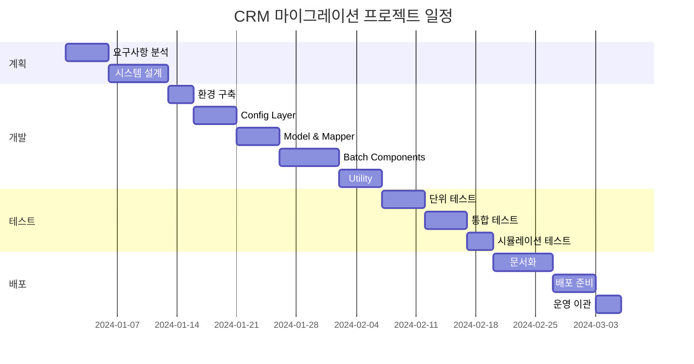

# CRM 테이블 마이그레이션 프로젝트 WBS

> **현재 구현 기준** (실제 코드베이스 반영)

## 프로젝트 개요

**프로젝트명**: CRM 테이블 SafeDB 암호화 마이그레이션

**목적**: 기존 테이블의 개인정보 컬럼에 SafeDB 암호화를 적용하는 Spring Batch 기반 마이그레이션 시스템 구축

**기술 스택**:

- Spring Boot 2.3.2
- Spring Batch 4.2.x
- MyBatis 1.3.5
- PostgreSQL
- Java 1.8

## 1. 프로젝트 계획 및 설계

### 1.1 요구사항 분석

- 암호화 대상 테이블 및 컬럼 식별
- SafeDB 암호화 정책 수립
- 성능 및 용량 요구사항 분석
- 백업 및 복구 정책 수립

### 1.2 시스템 설계

- 아키텍처 설계 ([PROJECT_DESIGN.md](PROJECT_DESIGN.md))
  - Spring Batch 기반 구조 설계
  - Reader/Processor/Writer 패턴 설계
  - 테이블별 Step 동적 생성 방식 설계
- 데이터베이스 설계
  - `migration_config` 설정 테이블 구조 설계
  - Primary Key 동적 조회 방식 설계
- 처리 흐름 설계 ([EXECUTION_FLOW.md](EXECUTION_FLOW.md))
  - Chunk 단위 처리 흐름
  - 트랜잭션 관리 전략
  - 에러 처리 및 재시도 전략

### 1.3 개발 표준 수립

- 코딩 컨벤션 정의
- 로깅 정책 수립 (DEBUG/TRACE 레벨)
- Profile 전략 수립 (local/dev/prod/debug)

## 2. 개발 환경 구축

### 2.1 로컬 개발 환경 설정 ([SETUP_GUIDE.md](SETUP_GUIDE.md))

- Java 1.8 설치 및 환경 변수 설정
- Maven 설치 및 설정
- PostgreSQL 설치 및 초기 설정
- IDE (STS/IntelliJ) 설정

### 2.2 데이터베이스 초기화

- PostgreSQL 데이터베이스 생성
- `migration_config` 테이블 생성 (DDL)
- Spring Batch 메타데이터 테이블 생성
- 샘플 데이터 생성 ([SIMULATION_SCENARIO.md](SIMULATION_SCENARIO.md))

### 2.3 프로젝트 설정

- Maven 프로젝트 생성 및 의존성 설정 ([pom.xml](pom.xml))
- Profile별 `application.yml` 설정
  - local: chunk-size 1000, INFO 로그
  - dev: chunk-size 3000, DEBUG 로그
  - prod: chunk-size 5000, INFO 로그
  - debug: chunk-size 100, TRACE 로그

## 3. 핵심 기능 개발

### 3.1 Config Layer 개발

- **DatabaseConfig** (`src/main/java/com/kt/yaap/mig_batch/config/DatabaseConfig.java`)
  - DataSource 설정 (단일 DB)
  - HikariCP 커넥션 풀 설정
- **MyBatisConfig** (`src/main/java/com/kt/yaap/mig_batch/config/MyBatisConfig.java`)
  - SqlSessionFactory 설정
  - BATCH 모드 ExecutorType 설정
  - Mapper XML 위치 설정
- **BatchConfig** (`src/main/java/com/kt/yaap/mig_batch/config/BatchConfig.java`)
  - `createTableEncryptionStep()`: 테이블별 암호화 Step 생성
  - Chunk 단위 설정
- **MigrationJobConfig** (`src/main/java/com/kt/yaap/mig_batch/config/MigrationJobConfig.java`)
  - Job 정의
  - 테이블별 Step 동적 생성 (encryptionStep_테이블명)
  - Step 순차 연결
- **SafeDBConfig**
  - SafeDB 라이브러리 초기화 설정

### 3.2 Model Layer 개발

- **MigrationConfigEntity** (`src/main/java/com/kt/yaap/mig_batch/model/MigrationConfigEntity.java`)
  - Lombok `@Data`, `@NoArgsConstructor` 적용
  - targetTableName, targetColumnName, status, priority
- **TargetRecordEntity** (`src/main/java/com/kt/yaap/mig_batch/model/TargetRecordEntity.java`)
  - Lombok `@Data` 적용
  - 명시적 생성자 (Map 필드 초기화)
  - tableName, pkColumnNames, pkValues
  - targetColumnNames, originalValues, encryptedValues
  - `getPkDisplay()` 메서드

### 3.3 Mapper Layer 개발

- **MigrationConfigMapper** (Java Interface + XML)
  - `selectActiveConfigs()`: ACTIVE 상태 설정 조회
  - `updateStatus()`: status 업데이트
- **TargetTableMapper** (Java Interface + XML)
  - `selectPrimaryKeyColumns()`: PK 컬럼 조회 (INFORMATION_SCHEMA, 복합키 지원)
  - `selectAllTargetColumnsStreaming()`: 테이블 레코드 스트리밍 조회 (Cursor)
  - `updateTargetRecordWithMultipleColumns()`: 레코드 단위 UPDATE
  - `bulkUpdateTargetRecords()`: 벌크 UPDATE (VALUES 방식)

### 3.4 Batch Components 개발

- **TableRecordReader** (`src/main/java/com/kt/yaap/mig_batch/batch/TableRecordReader.java`)
  - ItemReader 인터페이스 구현
  - INFORMATION_SCHEMA에서 PK 동적 조회 (복합키 지원)
  - 실제 테이블 레코드 직접 읽기
  - Map → TargetRecordEntity 변환
  - Iterator 기반 read() 구현
- **EncryptionProcessor** (`src/main/java/com/kt/yaap/mig_batch/batch/EncryptionProcessor.java`)
  - ItemProcessor 인터페이스 구현
  - SafeDBUtil을 사용한 암호화 처리
  - null/빈 문자열 처리
  - 여러 컬럼 암호화 (복합키 지원)
- **EncryptionWriter** (`src/main/java/com/kt/yaap/mig_batch/batch/EncryptionWriter.java`)
  - ItemWriter 인터페이스 구현
  - 암호화된 값으로 UPDATE (여러 컬럼 한 번에)
  - 벌크 업데이트 또는 레코드 단위 업데이트
  - 복합키 WHERE 절 동적 생성

### 3.5 Listener 개발

- **MigrationStatusListener** (`src/main/java/com/kt/yaap/mig_batch/listener/MigrationStatusListener.java`)
  - StepExecutionListener 인터페이스 구현
  - `beforeStep()`: Step 시작 로그
  - `afterStep()`: Step 완료 시 status → 'COMPLETE' 업데이트 (한 번만!)
  - ExitStatus 처리

### 3.6 Utility 개발

- **SafeDBUtil** (`src/main/java/com/kt/yaap/mig_batch/util/SafeDBUtil.java`)
  - `encrypt()`: SafeDB 암호화
  - `decrypt()`: SafeDB 복호화
  - 실제 SafeDB 라이브러리 연동

### 3.7 Scheduler 개발

- **MigrationScheduler** (`src/main/java/com/kt/yaap/mig_batch/scheduler/MigrationScheduler.java`)
  - `@Scheduled` 자동 실행 (cron)
  - `runMigrationJobManually()`: 수동 실행 메서드

## 4. 테스트 개발

### 4.1 단위 테스트

- Config 클래스 테스트
- Mapper 테스트 (MyBatis)
- Utility 테스트 (SafeDBUtil)

### 4.2 통합 테스트

- Reader/Processor/Writer 통합 테스트
- Step 실행 테스트
- Job 실행 테스트

### 4.3 수동 실행 테스트

- **ManualJobRunner** (`src/test/java/com/kt/yaap/mig_batch/ManualJobRunner.java`)
  - 개발 환경에서 수동 실행 테스트
- **ManualJobRerun** (`src/test/java/com/kt/yaap/mig_batch/ManualJobRerun.java`)
  - Job 재실행 시나리오 테스트

### 4.4 시뮬레이션 테스트

- 샘플 데이터를 사용한 전체 프로세스 검증 ([SIMULATION_SCENARIO.md](SIMULATION_SCENARIO.md))
- read_count 정확성 검증
- 암호화 결과 검증

## 5. 문서화

### 5.1 기술 문서 작성

- [README.md](README.md): 프로젝트 개요 및 빠른 시작
- [PROJECT_DESIGN.md](PROJECT_DESIGN.md): 상세 설계서
- [PROJECT_STRUCTURE.md](PROJECT_STRUCTURE.md): 프로젝트 구조
- [EXECUTION_FLOW.md](EXECUTION_FLOW.md): 실행 흐름 상세

### 5.2 운영 가이드 작성

- [SETUP_GUIDE.md](SETUP_GUIDE.md): 로컬 환경 설정
- [QUICK_START.md](QUICK_START.md): 빠른 시작 가이드
- [EXECUTION_GUIDE.md](EXECUTION_GUIDE.md): 통합 실행 가이드
- [LINUX_EXECUTION_GUIDE.md](LINUX_EXECUTION_GUIDE.md): Linux 서버 실행
- [PROFILE_GUIDE.md](PROFILE_GUIDE.md): Profile 설정 가이드
- [JVM_MEMORY_GUIDE.md](JVM_MEMORY_GUIDE.md): JVM 메모리 설정

### 5.3 개발자 가이드 작성

- [STS_IMPORT_GUIDE.md](STS_IMPORT_GUIDE.md): STS 임포트 가이드
- [STS_MANUAL_EXECUTION_GUIDE.md](STS_MANUAL_EXECUTION_GUIDE.md): STS 수동 실행
- [STS_JOB_RERUN_GUIDE.md](STS_JOB_RERUN_GUIDE.md): STS Job 재실행
- [JOB_RERUN_GUIDE.md](JOB_RERUN_GUIDE.md): Job 재실행 가이드
- [MIGRATION_CONFIG_DDL.md](MIGRATION_CONFIG_DDL.md): DDL 가이드
- [UPDATE_METHODS_EXPLANATION.md](UPDATE_METHODS_EXPLANATION.md): UPDATE 메서드 설명

### 5.4 시나리오 문서 작성

- [SIMULATION_SCENARIO.md](SIMULATION_SCENARIO.md): 시뮬레이션 시나리오

### 5.5 스크립트 작성

- `database_setup.sql`: 데이터베이스 초기화 스크립트
- `sample_data_setup.sql`: 샘플 데이터 생성 스크립트
- `init_database.ps1`: Windows 데이터베이스 초기화 스크립트
- `setup_windows.ps1`: Windows 환경 설정 스크립트
- `start.sh`: Linux 실행 스크립트

## 6. 배포 준비

### 6.1 빌드 및 패키징

- Maven clean package
- JAR 파일 생성 (`crm-mig-1.0.0.jar`)
- 의존성 라이브러리 포함 확인

### 6.2 환경별 설정

- local 환경 설정 검증
- dev 환경 설정 준비
- prod 환경 설정 준비
- 환경 변수 및 외부 설정 관리

### 6.3 배포 스크립트 작성

- 배포 자동화 스크립트
- 서비스 등록 스크립트 (systemd)
- 백업 및 복구 스크립트

## 7. 성능 최적화

### 7.1 쿼리 최적화

- 인덱스 생성 및 최적화
- 동적 쿼리 성능 개선
- MyBatis BATCH 모드 최적화

### 7.2 메모리 최적화

- Chunk Size 조정 (환경별)
- JVM 메모리 설정 튜닝
- 커넥션 풀 크기 조정

### 7.3 처리 속도 개선

- 벌크 업데이트(VALUES 방식)로 DB 왕복 횟수 감소
- 여러 컬럼 한 번에 UPDATE
- Step별 순차 처리로 안정성 확보

## 8. 운영 및 모니터링

### 8.1 로깅 체계 구축

- 로그 레벨별 출력 설정 (DEBUG/INFO/WARN/ERROR)
- MyBatis 쿼리 로그 설정 (TRACE)
- 처리 상태 로깅 (read_count, write_count)

### 8.2 모니터링 대시보드

- Spring Batch 메타데이터 조회
  - `batch_job_execution`
  - `batch_step_execution` (read_count 확인)
- 처리 진행 상황 모니터링
- 에러 발생 시 알림

### 8.3 에러 처리 및 재시도

- Chunk 단위 트랜잭션 롤백
- Step 실패 시 재실행 가능
- `migration_config` status 기반 재시도

## 9. 보안 및 백업

### 9.1 보안 강화

- SafeDB 암호화 정책 적용
- 데이터베이스 접근 권한 관리
- 환경 변수로 민감 정보 관리

### 9.2 백업 전략

- 데이터베이스 백업 (pg_dump)
- 백업 주기 및 보관 정책

### 9.3 복구 계획

- 백업 데이터 복구 절차
- 롤백 시나리오 정의
- 재실행 시나리오 문서화

## 10. 프로젝트 완료

### 10.1 최종 테스트

- 전체 시나리오 통합 테스트
- 성능 테스트 (대용량 데이터)
- 장애 시나리오 테스트

### 10.2 인수인계

- 운영 담당자 교육
- 장애 대응 매뉴얼 작성
- 유지보수 가이드 작성

### 10.3 프로젝트 종료

- 최종 보고서 작성
- 산출물 정리 및 아카이빙
- 회고 및 개선사항 도출

## 주요 마일스톤

## 핵심 성공 요인

- 테이블별 Step 동적 생성으로 정확한 read_count 집계
- 벌크 업데이트(VALUES 방식)로 성능 최적화
- 복합키 자동 지원
- Profile별 설정으로 환경별 최적화
- 상세한 문서화로 운영 효율성 확보
